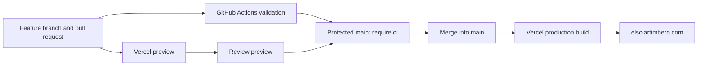

# Deploy El Solar Timbero

The application has passed local validation/database tests and browser checks. The owner has confirmed that the rate-limit migration is applied. Launch still requires a successful submission against the hosted database, production environment settings, and HTTPS/domain verification. Local CI uses a test HTTP service, so a green check does not prove the hosted credentials or database are configured correctly.

## How the pipeline works



GitHub Actions provides continuous integration (CI): it checks changes before release. Vercel's Git integration provides continuous deployment (CD): it builds the merged commit and publishes it. CI and preview builds can run at the same time. Vercel does **not** automatically wait for this workflow before deploying a push to `main`; the required-check branch protection rule is the production gate. A failed Vercel build does not replace the existing successful site. The CI build is a test artifact, not the artifact deployed to production; Vercel rebuilds with production settings.

The workflow requires no GitHub secrets. It runs on pull requests to `main`, pushes to `main`, merge-queue events, and manual requests. Its `ci` job passes only when both validation jobs pass. Those jobs run types, lint, validation/database tests, a production-dependency vulnerability check, a production build, and Chromium browser tests at mobile and desktop sizes. Failed browser checks upload screenshots/traces for seven days. New runs cancel obsolete runs on the same branch. Node 22, the committed npm lockfile, a fixed Ubuntu runner version, read-only repository permissions, and commit-pinned actions make the setup consistent and limit workflow access. Dependabot proposes weekly action/dependency updates; review and test them before merging.

Sources: [Vercel Git integration](https://vercel.com/docs/git/vercel-for-github), [GitHub protected branches](https://docs.github.com/en/repositories/configuring-branches-and-merges-in-your-repository/managing-protected-branches/about-protected-branches).

## 1. Put the release changes on GitHub

The rate-limit and deployment changes must be included in your release commit. From the project directory:

```sh
git switch -c launch/vercel-ci
git add .env.example README.md src/app/actions.ts src/components/rsvp/RsvpResult.tsx src/lib/rsvp-rate-limit.ts src/lib/rsvp-submit.ts supabase/migrations/20261002202858_add_rsvp_rate_limiting.sql tests/browser/rsvp.spec.ts tests/mock-supabase.mjs tests/rsvp-rate-limit.test.ts .github .nvmrc package.json package-lock.json vercel.json docs/deployment.md
git diff --cached --stat
git commit -m "Add RSVP protection and Vercel CI pipeline"
git push -u origin launch/vercel-ci
```

Open a pull request from `launch/vercel-ci` to `main` at [the repository](https://github.com/Felicity05/el-solar-timbero). GitHub will discover `.github/workflows/ci.yml` and start CI on the pull request. Review the staged file list before committing; local `.env.local` is ignored and must remain untracked. All hosted secrets belong in Vercel, not this commit.

**What happens:** GitHub now has a reproducible copy of your code and migration files. The PR records which changes will be released. CI tests them without writing to your hosted Supabase database.

## 2. Protect `main`

After the first PR has run so GitHub recognizes the `ci` check, open repository **Settings → Branches → Add branch protection rule**, targeting `main` (or create an equivalent branch ruleset).

- Require a pull request before merging.
- Require status checks and choose **`ci`**, with GitHub Actions as the expected source if offered.
- Require the branch to be up to date before merging.
- Apply the rule to administrators / disallow bypass, and keep force pushes and deletion disabled.
- Require conversation resolution. Require an approving review when there is another maintainer; a solo owner cannot approve their own PR.

GitHub's plan determines whether protection is available: public repositories support it on Free; private repositories need a plan that supports private-repository protection. If protection is unavailable, this pipeline is **not** an enforced release gate. Use a supported plan or restrict production to deliberate manual releases until a gate is available. Do not claim direct pushes are safe merely because CI also runs after the push.

**What happens:** GitHub refuses a merge when `ci` fails or is missing. This prevents a normal PR merge from triggering an unverified production release. After the rule is saved and CI passes, merge the initial release PR so Vercel can import the prepared `main` branch.

Source: [GitHub branch protection](https://docs.github.com/en/repositories/configuring-branches-and-merges-in-your-repository/managing-protected-branches/about-protected-branches).

## 3. Import the repository into Vercel

In the [Vercel dashboard](https://vercel.com/new), choose **Add New → Project**, connect GitHub, and import `Felicity05/el-solar-timbero`. Give the integration access to this repository. If a project already exists, connect it under **Settings → Git** instead of creating a second project.

Choose a plan appropriate for the site's use: [Vercel Hobby](https://vercel.com/docs/plans/hobby) is restricted to personal, non-commercial projects. If this site supports a business or commercial promotion, use a plan that permits that use rather than assuming free admission makes it a personal project.

Use these settings:

| Setting | Value |
| --- | --- |
| Framework | Next.js |
| Root directory | Repository root |
| Production branch | `main` |
| Node.js | 22.x |
| Install command | `npm ci` |
| Build command | `npm run build` |
| Output directory | Leave the Next.js default |

The Node version is also set in `package.json`; install/build commands are committed in `vercel.json`. The build uses the project's existing Webpack option. Allow Vercel to use its normal Next.js runtime; no static export or custom output directory is needed. The server action needs a running server function.

**What happens:** Vercel reads the repository, installs the exact locked dependencies, and compiles Next.js. It serves static assets through its delivery network and runs RSVP actions on the server. Each subsequent branch push can create a preview, and `main` is the production source.

Sources: [Vercel GitHub deployment](https://vercel.com/docs/git/vercel-for-github), [Node versions](https://vercel.com/docs/functions/runtimes/node-js/node-js-versions).

## 4. Configure production variables before the first deploy

Add these variables to the **Production** environment on the import screen or under **Settings → Environment Variables**:

| Name | Production value | Purpose |
| --- | --- | --- |
| `NEXT_PUBLIC_SUPABASE_URL` | Your real hosted Supabase project URL | Selects the database API endpoint; the URL is public. |
| `SUPABASE_SERVICE_ROLE_KEY` | The service role key from that same project | Authorizes server-side inserts and rate-limit RPC calls. Keep it server-only. |
| `SITE_URL` | `https://elsolartimbero.com` | Sets the base URL for social/share metadata. |

Use the real Supabase URL, never `http://127.0.0.1:54329`; that address is for local browser tests. Enable Vercel's automatic system environment variables if the setting is offered so `VERCEL=1` is available to the server. The app then uses Vercel's IP header for the shared rate limiter. Do not configure `RSVP_TRUSTED_IP_HEADER` for Vercel.

For **Preview**, use a separate staging Supabase project with both migrations applied and its own URL/key. If staging is not set up yet, leave the Supabase variables unset in Preview: visual previews will render, but RSVP submissions will show an error. Do not select “all environments” for the production service role key; preview code should not have access to live RSVP records. Keep fork-deployment protection enabled. CI already has a local mock and needs no database secrets.

**What happens:** Vercel gives the server its database credentials. Build-time variables also affect the generated app. Changing variables does not update an already-built deployment; redeploy after changing them. The browser never receives the service role key.

Sources: [Vercel environment variables](https://vercel.com/docs/environment-variables), [system variables](https://vercel.com/docs/environment-variables/system-environment-variables), [request headers](https://vercel.com/docs/headers/request-headers).

## 5. Deploy and check the `.vercel.app` URL first

Click **Deploy** and inspect the build logs. When the deployment is Ready, open its provided `.vercel.app` URL before changing DNS.

Use your own contact details for one deliberate production smoke test:

- Submit valid information with the notice accepted. Confirm the success screen and one matching row in Supabase.
- Submit the same phone using a different format and email. Confirm the duplicate screen and that the original row was not changed.
- Try invalid fields and an unchecked notice; confirm no new row is inserted.
- Keep the normal success/duplicate attempts below the five-phone-attempt allowance. Test a full rate-limit cycle in staging, since intentionally consuming production limits affects real traffic.
- Check on an actual phone, keyboard navigation, and the Instagram in-app browser. The confirmation is on-screen; the app does not send email/SMS.

Verify hosted permissions using Supabase's SQL editor without exposing private records:

```sql
select
  to_regclass('rsvp_private.rsvp_rate_limits') is not null as counter_table_exists,
  has_function_privilege('service_role', 'public.consume_rsvp_rate_limit(text,text)', 'EXECUTE') as server_can_limit,
  not has_function_privilege('anon', 'public.consume_rsvp_rate_limit(text,text)', 'EXECUTE') as anonymous_rpc_blocked,
  not has_function_privilege('authenticated', 'public.consume_rsvp_rate_limit(text,text)', 'EXECUTE') as authenticated_rpc_blocked,
  has_table_privilege('service_role', 'public.rsvps', 'INSERT') as server_can_insert,
  not has_table_privilege('service_role', 'public.rsvps', 'SELECT') as server_cannot_list,
  not has_table_privilege('anon', 'public.rsvps', 'SELECT') as anonymous_read_blocked,
  not has_table_privilege('anon', 'public.rsvps', 'INSERT') as anonymous_insert_blocked;
```

Expect every value to be `true`. A missing RPC can cause this query to error; that is a configuration failure to resolve before launch. Also verify that requests to the RSVP Data API with a publishable/anonymous key cannot read or insert rows. This checks the deployed API configuration in addition to the SQL grants.

**What happens:** This is the first end-to-end check of Vercel → hosted Supabase. It catches missing credentials, an unavailable RPC, mismatched projects, and un-applied grants that local CI cannot discover.

## 6. Connect `elsolartimbero.com`

Open **Vercel project → Settings → Domains**. Add `elsolartimbero.com`, then `www.elsolartimbero.com`. Choose the bare domain as canonical and configure `www` to redirect to it. Keep `SITE_URL=https://elsolartimbero.com` consistent with that choice.

Vercel will show the **exact DNS records for this project**. At your existing DNS provider, copy those values:

| Domain | Typical record type | Host/name |
| --- | --- | --- |
| `elsolartimbero.com` | A (use the type Vercel actually displays) | `@` or the provider's root-domain form |
| `www.elsolartimbero.com` | CNAME | `www` |
| Ownership verification, if requested | TXT | Exact name displayed by Vercel |

Use the values shown by Vercel rather than an old IP address or CNAME copied from a tutorial. Replace conflicting web records for these names while preserving mail records (MX and SPF/DKIM/DMARC TXT). You can keep your existing registrar and nameservers; a transfer to Vercel is unnecessary. If Cloudflare manages DNS, start with these web records set to DNS-only while validating Vercel.

Wait for Vercel to report valid configuration and issue HTTPS, then open `https://elsolartimbero.com` and confirm `https://www.elsolartimbero.com` redirects. Cached DNS can take time to expire; use the dashboard's verification status rather than promising a specific propagation time. Check the share image and title on the final URL.

**What happens:** DNS directs visitors to Vercel. The HTTPS certificate encrypts browser traffic. The canonical redirect gives both domain names one destination. Future production releases update Vercel's domain routing; you normally leave DNS unchanged.

Source: [Vercel custom-domain setup](https://vercel.com/docs/domains/working-with-domains/add-a-domain).

## 7. Use the pipeline for future releases

Create a feature branch, commit changes, push it, and open a PR to `main`. Wait for `ci`, review the preview, and merge. Vercel then builds with Production variables and updates the domain after the deployment succeeds. Confirm the production deployment is Ready and do a brief post-release check. Direct pushes and manual production promotions bypass this PR path; restrict those to deliberate recovery operations.

Keep database migrations explicit. Test new migrations in staging and review them before production. For additive, backward-compatible schema changes, apply the migration before deploying code that uses it. For breaking changes, use an expand/migrate/contract sequence across releases. Keep the exact applied SQL in version control, even when it was applied manually through Supabase. CI tests SQL in embedded Postgres but does **not** apply migrations to the hosted project. Do not add production database credentials to a pull-request workflow.

Use Vercel deployment logs to diagnose RSVP errors; application logs omit contact details and database credentials. Observe failures and traffic after a release. App rate limits do not replace host-level flood protection; evaluate available Vercel firewall/bot controls as traffic grows.

For recovery, use the Vercel deployment menu's rollback action to restore a prior good release where available, then open a revert/fix PR so Git matches production. A deployment rollback does not undo database migrations or restore data. Keep migrations compatible with the prior app version. After an instant rollback, review Vercel's rollback state and deliberately resume/promote the fixed release; automatic production-domain assignment can remain paused.

Source: [Vercel Instant Rollback](https://vercel.com/docs/instant-rollback).
